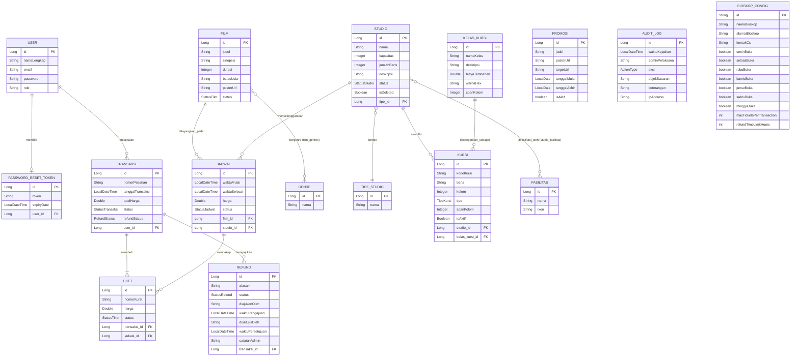

# Entity Relationship Diagram (ERD) - CineMax Booking System

Berikut adalah diagram relasi entitas untuk database CineMax Booking System yang dihasilkan dari domain code Spring Boot.

```mermaid
erDiagram
    USER {
        Long id PK
        String namaLengkap
        String email
        String password
        String role
    }

    PASSWORD_RESET_TOKEN {
        Long id PK
        String token
        LocalDateTime expiryDate
        Long user_id FK
    }

    TRANSAKSI {
        Long id PK
        String nomorPesanan
        LocalDateTime tanggalTransaksi
        Double totalHarga
        StatusTransaksi status
        RefundStatus refundStatus
        Long user_id FK
    }

    TIKET {
        Long id PK
        String nomorKursi
        Double harga
        StatusTiket status
        Long transaksi_id FK
        Long jadwal_id FK
    }

    REFUND {
        Long id PK
        String alasan
        StatusRefund status
        String diajukanOleh
        LocalDateTime waktuPengajuan
        String disetujuiOleh
        LocalDateTime waktuPersetujuan
        String catatanAdmin
        Long transaksi_id FK
    }

    JADWAL {
        Long id PK
        LocalDateTime waktuMulai
        LocalDateTime waktuSelesai
        Double harga
        StatusJadwal status
        Long film_id FK
        Long studio_id FK
    }

    FILM {
        Long id PK
        String judul
        String sinopsis
        Integer durasi
        String batasUsia
        String posterUrl
        StatusFilm status
    }

    GENRE {
        Long id PK
        String nama
    }

    STUDIO {
        Long id PK
        String nama
        Integer kapasitas
        Integer jumlahBaris
        String deskripsi
        StatusStudio status
        Boolean isDeleted
        Long tipe_id FK
    }

    TIPE_STUDIO {
        Long id PK
        String nama
    }

    KURSI {
        Long id PK
        String kodeKursi
        String baris
        Integer kolom
        TipeKursi tipe
        Integer spanKolom
        Boolean isAktif
        Long studio_id FK
        Long kelas_kursi_id FK
    }

    KELAS_KURSI {
        Long id PK
        String namaKelas
        String deskripsi
        Double biayaTambahan
        String warnaHex
        Integer spanKolom
    }

    FASILITAS {
        Long id PK
        String nama
        String ikon
    }

    PROMOSI {
        Long id PK
        String judul
        String posterUrl
        String targetUrl
        LocalDate tanggalMulai
        LocalDate tanggalAkhir
        boolean isAktif
    }

    AUDIT_LOG {
        Long id PK
        LocalDateTime waktuKejadian
        String adminPelaksana
        ActionType aksi
        String objekSasaran
        String keterangan
        String ipAddress
    }

    BIOSKOP_CONFIG {
        String id PK
        String namaBioskop
        String alamatBioskop
        String kontakCs
        boolean seninBuka
        boolean selasaBuka
        boolean rabuBuka
        boolean kamisBuka
        boolean jumatBuka
        boolean sabtuBuka
        boolean mingguBuka
        int maxTicketsPerTransaction
        int refundTimeLimitHours
    }

    %% Relationships
    USER ||--o{ TRANSAKSI : "melakukan"
    USER ||--o| PASSWORD_RESET_TOKEN : "memiliki"
    
    TRANSAKSI ||--|{ TIKET : "membeli"
    TRANSAKSI ||--o{ REFUND : "mengajukan"
    
    JADWAL ||--o{ TIKET : "mencakup"
    FILM ||--o{ JADWAL : "ditayangkan_pada"
    STUDIO ||--o{ JADWAL : "menyelenggarakan"
    
    STUDIO }o--|| TIPE_STUDIO : "bertipe"
    STUDIO ||--o{ KURSI : "memiliki"
    STUDIO }o--o{ FASILITAS : "difasilitasi_oleh (studio_fasilitas)"
    
    KELAS_KURSI ||--o{ KURSI : "dikategorikan_sebagai"
    
    FILM }o--o{ GENRE : "bergenre (film_genres)"
```
